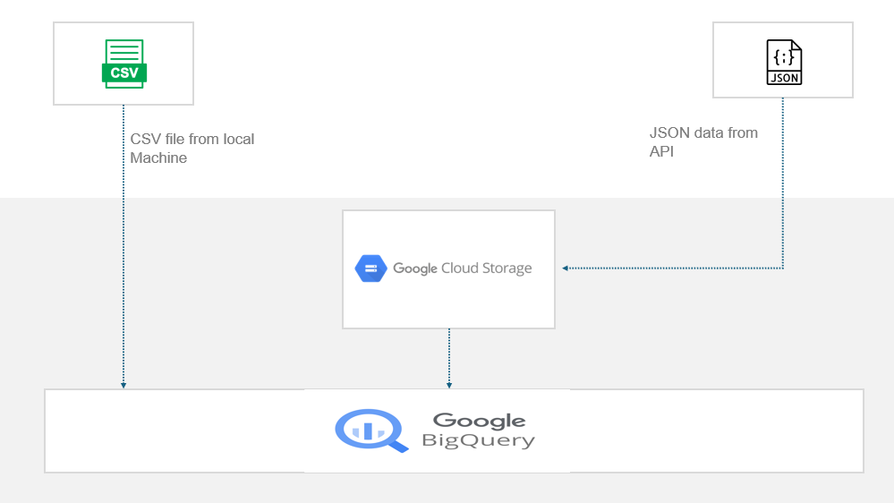

# Interacting with GCS and BigQuery from python

<p align="center">
  
</p>

## 📕 Table Of Contents
* [Overview](#project-overview)
* [The Data](#the-data)
* [Project Structure](#project-structure)
* [Installation and Setup](#installation-and-setup)
* [Configuration](#configuration)
* [Usage](#usage)
* [Implementation Details](#implementation-details)
* [Example Output](#example-output)
* [Error Handling](#error-handling)
* [License](#license)

# Overview
This project demonstrates how to interact with Google Cloud Storage (GCS) and Google BigQuery using Python, adhering to the DRY (Don't Repeat Yourself) principle to ensure the solution is easily extensible and reusable. It allows users to:

- Load flat files in CSV format from their local machine directly into a Google BigQuery table.

- Load data from an API into a GCS bucket as JSON/JSONL and into a BigQuery table.

### Key Features

- Idempotency: Ensures that running the code multiple times yields the same result, avoiding duplicate data in BigQuery.

- Reusability: The code is designed to be highly reusable, with functions and classes that can be easily adapted and integrated into other projects.

- Comprehensive Documentation: Includes detailed documentation with doc strings within functions/methods and type hints in function/method signatures, making the code easy to understand and extend.

# The Data
The csv data is sourced from [Kaggle](https://www.kaggle.com/datasets/aungpyaeap/supermarket-sales) and consists of a CSV file named **```supermarket_sales.csv```**. You can interact with the API url used in this project [here](https://sampleapis.com/api-list/playstation).

# Project Structure
```plain text
py_gcs_bq/
│
├── data/
│   └── supermarket_sales.csv      # Example CSV file for loading into BigQuery
│
├── schemas/
│   └── schema.json                # BigQuery table schema for API data
│
├── __init__.py                    # Empty script to make directory a package
│
├── .env.example                   # Template for environment variables
│
├── api_loader.py                  # Script to fetch API data, save to GCS, and load into BigQuery
│
├── config.py                      # Configuration file to load environment variables
│
├── csv_loader.py                  # Script to load CSV files into BigQuery
│
├── main.py                        # Main script to run CSV and API data loading tasks
│
└── requirements.txt               # Python dependencies
```

# Installation and Setup

#### Clone the repository:

```bash
git clone https://github.com/Isioma57/altschool_portfolio.git
cd py_gcs_bq
```
#### Create a virtual environment and activate it:

```bash
python -m venv venv
source venv/Scripts/activate # On MacOs use `source venv/bin/activate`
```

#### Install required packages:

```bash
pip install -r requirements.txt
```

# Configuration

Before running the scripts, rename .env.example to .env and fill in your credentials and project-specific information:

```plain text
# Google Cloud credentials
GOOGLE_APPLICATION_CREDENTIALS=your_google_application_credentials_json_path

# Project ID
PROJECT_ID=your_project_id

# Load CSV data directly into Google BigQuery
BIGQUERY_DATASET=your_bigquery_dataset
BIGQUERY_TABLE=your_bigquery_table
CSV_FILE_PATH=your_csv_file_path

# API credentials and settings for loading API data into GCS bucket and BigQuery
GCS_BUCKET_NAME=your_gcs_bucket_name
API_ENDPOINT=your_api_endpoint
API_BIGQUERY_DATASET=your_api_bigquery_dataset
API_BIGQUERY_TABLE=your_api_bigquery_table
```

# Usage
- Ensure your .env file is configured correctly.

- Run the main.py script:
```py
python main.py
```

# Implementation Details

### csv_loader.py
- **CsvLoader class**:
    - `__init__`: Initializes the loader with project, dataset, and table information.

    - `create_dataset`: Creates a BigQuery dataset if it does not exist.

    - `load_csv_to_bigquery`: Loads the CSV file into a BigQuery table.

- The schema for the table is set to be autodetected by BigQuery.


### api_loader.py

- **ApiLoader class**:
    - `__init__`: Initializes the loader with GCS bucket, BigQuery dataset and table, and API URL.

    - `fetch_data_from_api`: Fetches data from the API.

    - `convert_to_jsonlines`: Converts a list of JSON records to JSON Lines format.

    - `create_gcs_bucket`: Creates a GCS bucket if it does not exist.

    - `save_data_to_gcs`: Saves data to GCS.

    - `create_bigquery_dataset`: Creates a BigQuery dataset if it does not exist.

    - `create_bigquery_table`: Creates a BigQuery table if it does not exist.

    - `load_json_to_bigquery`: Loads JSON Lines data from GCS to BigQuery.

    - `execute`: Executes the entire pipeline: fetch API data, save to GCS, and load to BigQuery.

### main.py

- `load_csv_task`: Loads a CSV file into a BigQuery table.

- `load_api_task`: Fetches data from an API, saves it to GCS, and loads it into a BigQuery table.

# Example Output

After running the scripts, you should see logs indicating the successful creation of datasets and tables, as well as the number of rows loaded into BigQuery.

# Error Handling

All errors are logged using Python's logging module. Check the logs for detailed information if something goes wrong.

# License

This project is licensed under the MIT License.